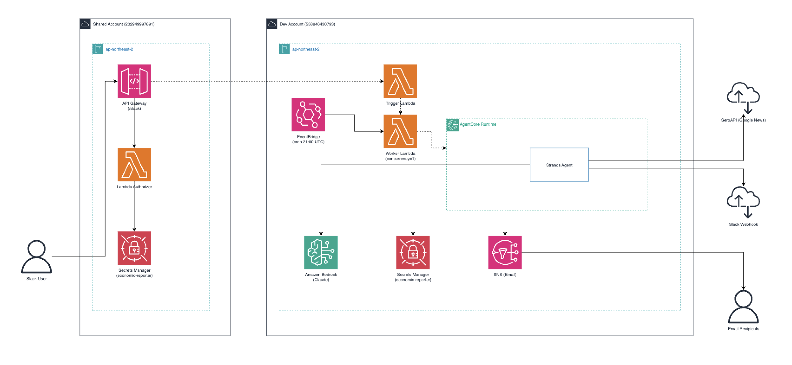

# Economic Reporter

EventBridge 스케줄 또는 Slack `/report` 명령으로 트리거되는 AI 에이전트 배치 잡. 최근 24시간 경제·금융 뉴스를 수집·분석해 Slack과 이메일로 보고서를 자동 발송합니다.

---

## 주요 기능

- **뉴스 수집** — SerpAPI(Google News)로 최근 24시간 경제·금융 뉴스 자동 수집
- **AI 분석** — AWS Bedrock Claude가 뉴스를 요약·분석하고 핵심 인사이트 도출
- **보고서 생성** — 시장 동향, 주요 이슈, 리스크 요인을 포함한 구조화된 경제 보고서 생성
- **멀티채널 발송** — Slack Block Kit 형식 + 이메일(AWS SNS) 동시 발송

## 보고서 섹션

1. 중요 경제 뉴스
2. 미국 증시 동향
3. 글로벌 증시 동향 (유럽·중국·일본)
4. 한국 증시 동향
5. 환율 / 금리 / 원자재
6. 채권 시장
7. 섹터 & 테마 동향
8. 주요 경제 이벤트 예고
9. 주요 기업 이슈 _(해당 이슈 없을 경우 생략)_
10. 요약 및 전략적 시사점

---

## 아키텍처

```bash
[트리거]
  ├─ EventBridge cron (매일 KST 06:00)
  └─ Slack /report → API GW → Trigger Lambda (3초 내 응답)
         ↓
  Worker Lambda (비동기)
         ↓
  AgentCore Runtime (Strands Agent + Bedrock Claude Sonnet 4)
         ↓
  [도구 실행]
    ├─ SerpAPI로 뉴스 수집 (9개 쿼리)
    ├─ Slack Block Kit으로 보고서 전송
    └─ AWS SNS로 이메일 전송
```




**트리거 경로**
- **Slack 온디맨드**: Slack → API GW → Trigger Lambda → Worker Lambda → AgentCore
- **스케줄 자동 실행**: EventBridge cron → Worker Lambda → AgentCore (매일 KST 06:00)

> Trigger Lambda는 Slack 3초 응답 제한을 준수하기 위해 Worker Lambda를 비동기(`InvocationType=Event`)로 호출하고 즉시 200을 반환합니다.

---

## 기술 스택

| 구분 | 기술 |
|------|------|
| Agent Framework | [Strands SDK](https://github.com/strands-agents/sdk-python) |
| LLM | AWS Bedrock — Claude Sonnet (`global.anthropic.claude-sonnet-4-6`) |
| Agent 배포 | AWS AgentCore (컨테이너 기반) |
| 스케줄 트리거 | AWS EventBridge cron → Worker Lambda |
| 온디맨드 트리거 | Slack Slash Command → API Gateway → Trigger Lambda → Worker Lambda |
| Slack 인증 | Lambda Authorizer (X-Slack-Signature HMAC 검증) |
| 뉴스 수집 | [SerpAPI](https://serpapi.com/) (Google News) |
| 시크릿 관리 | AWS Secrets Manager (`economic-reporter` 통합 시크릿) |
| 인프라 | Terraform (멀티 계정: dev / shared) |
| 알림 | Slack Block Kit Webhook, AWS SNS Email |
| 언어 | Python 3.11 |

---

## 프로젝트 구조

```
economic-reporter/
├── agent/
│   ├── main.py                # AgentCore 엔트리포인트 + 로컬 실행 진입점
│   ├── config.py              # Secrets Manager → os.environ 주입
│   └── prompts.py             # 시스템 프롬프트 · 보고서 템플릿
├── tools/
│   ├── news_fetcher.py        # 뉴스 수집 Tool (SerpAPI)
│   ├── slack_notifier.py      # Slack Block Kit 발송 Tool
│   └── email_sender.py        # 이메일 발송 Tool (AWS SNS)
├── trigger/
│   ├── slack_handler.py       # Slack 이벤트 수신 → Worker Lambda 비동기 호출
│   ├── agentcore_worker.py    # Worker Lambda — AgentCore invoke
│   └── slack_authorizer.py    # Slack Signing Secret 기반 Lambda Authorizer
├── terraform/
│   ├── account/
│   │   ├── dev/               # dev 계정 루트 모듈
│   │   │   ├── main.tf        # lambda + eventbridge 모듈 호출
│   │   │   ├── output.tf
│   │   │   └── environments/dev.tfvars
│   │   └── shared/            # shared 계정 루트 모듈
│   │       ├── main.tf        # authorizer + apigateway 모듈 호출
│   │       ├── output.tf
│   │       └── environments/shared.tfvars
│   └── modules/
│       ├── lambda/            # Trigger Lambda + Worker Lambda (dev)
│       ├── eventbridge/       # EventBridge cron 규칙 (dev)
│       ├── authorizer/        # Slack Authorizer Lambda (shared)
│       └── apigateway/        # REST API Gateway (shared)
├── .bedrock_agentcore.yaml    # AgentCore 배포 설정
├── Dockerfile                 # AgentCore 컨테이너 이미지
├── requirements-agentcore.txt # AgentCore 컨테이너 의존성
├── pyproject.toml
└── README.md
```

---

## 계정 분리 구조

| 리소스 | 계정 | 설명 |
|--------|------|------|
| EventBridge Rule | dev | `cron(0 21 * * ? *)` — KST 06:00 자동 실행 |
| Trigger Lambda | dev | Slack 이벤트 수신 → Worker 비동기 호출 |
| Worker Lambda | dev | AgentCore invoke (concurrency=1, retry=0) |
| Lambda Authorizer | shared | X-Slack-Signature HMAC 검증 |
| API Gateway | shared | `/slack` POST 엔드포인트 |
| Secrets Manager | dev | `economic-reporter` (SERPAPI_API_KEY, SLACK_WEBHOOK_URL, SNS_TOPIC_ARN, SLACK_SIGNING_SECRET) |
| AgentCore Runtime | dev | `economic_reporter-Zx64Bh783b` |

> **cross-account 호출**: shared 계정 API Gateway가 dev 계정 Trigger Lambda를 직접 호출합니다. shared 계정 `main.tf`는 `terraform_remote_state`로 dev tfstate에서 Lambda invoke ARN을 읽습니다.

---

## Getting Started

### 사전 요구사항

- Python 3.11+ / [uv](https://github.com/astral-sh/uv)
- AWS 계정 및 Bedrock Claude 모델 접근 권한
- Slack App (Slash Command 설정)
- SerpAPI 키

### 설치

```bash
git clone <repo-url>
cd economic-reporter
uv sync
```

### 환경 변수 (로컬 실행용)

프로젝트 루트에 `.env` 파일 생성:

```dotenv
AWS_REGION=ap-northeast-2
AWS_BEDROCK_MODEL_ID=global.anthropic.claude-sonnet-4-6

SERPAPI_API_KEY=your_serpapi_key
SLACK_WEBHOOK_URL=https://hooks.slack.com/services/...
SNS_TOPIC_ARN=arn:aws:sns:ap-northeast-2:...
```

### 로컬 실행

```bash
uv run python agent/main.py
```

---

## 배포

### 1. Terraform (인프라)

두 계정 모두 `bys-shared-ap2-s3-terraform` 버킷을 tfstate 백엔드로 사용합니다.

```bash
# dev 계정 먼저 apply (Worker Lambda ARN이 shared tfstate에서 참조됨)
cd terraform/account/dev
terraform init
terraform plan -var-file=environments/dev.tfvars
terraform apply -var-file=environments/dev.tfvars

# shared 계정
cd ../shared
terraform init
terraform plan -var-file=environments/shared.tfvars
terraform apply -var-file=environments/shared.tfvars
```

### 2. AgentCore (AI 에이전트 컨테이너)

```bash
cd <project-root>
uv run agentcore deploy
```

`agentcore deploy`는 CodeBuild를 통해 Docker 이미지를 빌드·ECR 푸시하고 AgentCore Runtime을 업데이트합니다.

---

## 설정

### 실행 스케줄

`terraform/account/dev/environments/dev.tfvars`의 `schedule` 변수로 변경합니다.

```hcl
schedule = "cron(0 21 * * ? *)"  # UTC 21:00 = KST 06:00
```

### Slack Slash Command 설정

1. [api.slack.com/apps](https://api.slack.com/apps)에서 Slack App 생성
2. **Slash Commands** 메뉴에서 `/report` 커맨드 추가
   - Request URL: `https://<api-gw-id>.execute-api.ap-northeast-2.amazonaws.com/dev/slack`
3. **Basic Information > Signing Secret**을 Secrets Manager에 저장

```bash
aws secretsmanager put-secret-value \
  --secret-id economic-reporter \
  --secret-string '{
    "SERPAPI_API_KEY": "...",
    "SLACK_WEBHOOK_URL": "https://hooks.slack.com/services/...",
    "SNS_TOPIC_ARN": "arn:aws:sns:...",
    "SLACK_SIGNING_SECRET": "..."
  }' \
  --region ap-northeast-2
```

### 시크릿 구조 (AWS Secrets Manager)

모든 시크릿은 `economic-reporter` 단일 시크릿 내 키/값으로 관리합니다.

| 키 | 설명 | 사용처 |
|----|------|--------|
| `SERPAPI_API_KEY` | SerpAPI 인증 키 | AgentCore (news_fetcher) |
| `SLACK_WEBHOOK_URL` | Slack Incoming Webhook URL | AgentCore (slack_notifier) |
| `SNS_TOPIC_ARN` | SNS 토픽 ARN | AgentCore (email_sender) |
| `SLACK_SIGNING_SECRET` | Slack Signing Secret | Trigger Lambda, Authorizer Lambda |

---

## 로드맵

- [ ] 뉴스 소스 다양화 (RSS, 네이버 뉴스 등)
- [ ] 보고서 섹션 커스터마이징 (관심 종목, 섹터 필터)
- [ ] 주간/월간 요약 보고서 지원
- [ ] 보고서 히스토리 저장 (S3)
